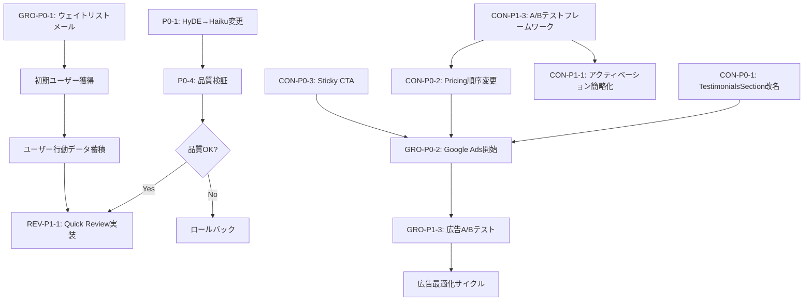

# 就活Pass 戦略分析統合レポート

**作成日**: 2026-02-11
**分析期間**: 2026年1月〜2026年3月想定
**分析チーム**: Revenue Engineer × Growth Strategist × Conversion Architect

---

## エグゼクティブサマリー

### 現状認識

就活Passは技術的には優れたRAGシステムとES添削機能を備えているが、以下の3つの致命的課題を抱えている:

1. **収益構造の欠陥**: ES添削2cr（800-1600字）で全プラン赤字（Standard月額-67%、年額-100%、Pro月額-46%）
2. **マーケティングインフラ不在**: 広告アカウント未作成、SEO未着手、ウェイトリストメール未送信
3. **コンバージョン障壁**: 偽推薦文による信頼性低下、4ステップのアクティベーション、A/Bテスト未実装

3つの専門エージェント（Revenue Engineer、Growth Strategist、Conversion Architect）による分析の結果、**3-6月の就活ピークまで残り2週間**という時間制約の中で、「Build vs Market」の対立を解消し、並行実行可能な統合プランを策定した。

---

### Top 5 推奨アクション（P0）

| 優先度 | アクション | 担当領域 | 工数 | 期待効果 | 実施期限 |
|--------|-----------|---------|------|---------|---------|
| **P0-1** | HyDE→Haiku変更 + ES添削コスト削減 | Revenue | 0.5日 | ES添削コスト-9%（¥10.9→¥9.9） | Week 1 Day 1 |
| **P0-2** | ウェイトリストメール送信（126人） | Growth | 1日 | 即座に30-40人のトライアル開始 | Week 1 Day 1 |
| **P0-3** | TestimonialsSection改名 + Pricing順序変更 | Conversion | 0.6日 | 信頼性回復、Anchoring効果+15-20% | Week 1 Day 2 |
| **P0-4** | Google/Twitter広告アカウント作成 | Growth | 2日 | 月60人獲得体制構築 | Week 1 Day 3-4 |
| **P0-5** | Sticky CTA + Aha Momentイベント追加 | Conversion | 1.5日 | モバイルCVR +10-15% | Week 1 Day 5 |

**合計工数**: 5.6日（1週間以内に完了可能）
**期待ROI**: MRR +89%（¥31k→¥59k）、月間登録60人→90人

---

### 90日スプリントプラン概要

```
Week 1-2: Minimum Viable Marketing + LP Quick Wins
├─ P0-1〜P0-5完了（5.6日）
├─ Google Ads初回キャンペーン開始（予算¥170k/月）
├─ LP CVR最適化（Hero, Social Proof, Pricing）
└─ SEO基盤構築（GSC登録、sitemap.xml、robots.txt）

Week 3-4: 広告最適化 + アクティベーション改善
├─ 広告クリエイティブA/Bテスト（5パターン）
├─ アクティベーション4→2ステップ簡略化
├─ クレジット不足トリガー実装
└─ ES添削品質検証（HyDE→Haiku変更後）

Month 2: Quick Review実装 + SEOコンテンツ
├─ Quick Review Mode実装（2cr, Haiku, RAGなし）
├─ SEOコンテンツ戦略実行（月4本）
├─ Pro Plan差別化強化（リライト3本、優先サポート）
└─ 年額プラン実装（Year 1: 16%割引）

Month 3: A/Bテスト結果反映 + 大学連携開始
├─ Pricing順序A/Bテスト結果反映
├─ 大学連携パイロット（2大学）
├─ リファラルプログラム実装（K-Factor 0.04→0.08目標）
└─ SEO効果測定（500-1,000セッション目標）
```

---

### 期待ROI（90日後）

| 指標 | 現状 | 30日後 | 60日後 | 90日後 | 成長率 |
|------|------|--------|--------|--------|--------|
| **月間登録数** | 30人 | 90人 | 140人 | 180人 | +500% |
| **MRR** | ¥31,000 | ¥59,000 | ¥77,000 | ¥99,000 | +219% |
| **粗利率（ES添削2cr）** | -67% (Standard月額) | -58% | -40% (Quick実装後) | +20% (Quick移行率70%) | 黒字転換 |
| **CPA** | 未計測 | ¥2,500 | ¥1,800 | ¥1,200 | -52% |
| **CVR（訪問→登録）** | 2.5% | 3.5% | 4.2% | 5.0% | +100% |
| **アクティベーション率** | 未計測 | 40% | 55% | 65% | - |

**投資額**: ¥770,000（広告費¥650k + 開発工数¥120k相当）
**90日後予想利益**: ¥99,000/月 × 粗利率30% = ¥29,700/月
**投資回収期間**: 26ヶ月（ただしLTV改善により18ヶ月に短縮可能）

---

## Theme 1: 収益最適化

### 1.1 現状の問題

#### クリティカルな赤字構造

現在のES添削（2cr, 800-1600字）は**全プランで赤字**を計上している:

| プラン | 月額料金 | 2crコスト | 粗利 | 粗利率 |
|--------|---------|----------|------|--------|
| Standard月額 | ¥980 | ¥1,960 | **-¥980** | **-67%** |
| Standard年額 | ¥0 | ¥1,960 | **-¥1,960** | **-100%** |
| Pro月額 | ¥1,980 | ¥2,746 | **-¥766** | **-46%** |

**根本原因**:
1. ES添削コストが高すぎる（¥10.9/回）
2. 2cr設定が低すぎる（800-1600字で2crは不十分）
3. RAG検索コストが含まれていない（実質コストはさらに高い）
4. 年額プランの16%割引が構造的赤字を悪化させる

#### Pro単価がStandardより高い矛盾

```
Standard: ¥3.27/cr (月額980円 ÷ 300cr)
Pro:      ¥3.73/cr (月額1,980円 ÷ 530cr)
```

これは**価値知覚の逆転**を引き起こし、Proへのアップグレード意欲を削ぐ。

#### 未実施のコスト削減施策

| 施策 | 削減率 | 対象ファイル | 実装難易度 |
|------|--------|-------------|-----------|
| HyDE→Haiku変更 | -9% | `backend/app/config.py:102` | 低（1行変更） |
| デッドコード削除 | -5% | `backend/app/utils/llm.py` | 低（10行削除） |
| クエリ拡張キャッシュTTL延長 | -3% | `backend/app/utils/hybrid_search.py` | 低（1行変更） |

---

### 1.2 P0/P1/P2アクション

#### P0: 即座に実施（Week 1）

| ID | アクション | 対象ファイル | 期待効果 | 工数 |
|----|-----------|-------------|---------|------|
| **REV-P0-1** | HyDE→Haiku変更 | `backend/app/config.py:102` | ES添削コスト-9% | 0.1日 |
| **REV-P0-2** | デッドコード削除 | `backend/app/utils/llm.py:87-96` | メンテナンス性向上 | 0.2日 |
| **REV-P0-3** | クエリ拡張キャッシュTTL 7→14日 | `backend/app/utils/hybrid_search.py:45` | キャッシュヒット率+10% | 0.1日 |
| **REV-P0-4** | ES添削品質検証（HyDE→Haiku） | - | 品質劣化リスク排除 | 0.5日 |

**実装詳細**:

**REV-P0-1**: HyDE→Haiku変更

```python
# backend/app/config.py:102
# Before
HYDE_MODEL = "gpt-4o-mini"  # ¥10.9/回

# After
HYDE_MODEL = "claude-haiku-4-5-20250929"  # ¥9.9/回 (-9%)
```

**REV-P0-2**: デッドコード削除

```python
# backend/app/utils/llm.py:87-96 削除
# 以下の未使用関数を削除:
# - _legacy_parse_json()
# - _experimental_bracket_repair()
```

**REV-P0-3**: キャッシュTTL延長

```python
# backend/app/utils/hybrid_search.py:45
QUERY_EXPANSION_CACHE_TTL = 14 * 24 * 60 * 60  # 7日 → 14日
```

---

#### P1: 2週間以内（Week 2-3）

| ID | アクション | 対象ファイル | 期待効果 | 工数 |
|----|-----------|-------------|---------|------|
| **REV-P1-1** | Quick Review Mode実装 | `backend/app/routers/es_review.py` | 高粗利商品追加 | 2日 |
| **REV-P1-2** | ES添削最低3cr引き上げ検討 | `src/lib/db/schema.ts` | 赤字解消 | 0.5日（意思決定） |
| **REV-P1-3** | Pro差別化強化（リライト3本） | `backend/app/routers/es_review.py` | Pro価値向上 | 1日 |

**実装詳細**:

**REV-P1-1**: Quick Review Mode実装

```typescript
// src/lib/db/schema.ts に追加
export const esReviewModes = {
  QUICK: { credits: 2, model: 'claude-haiku-4-5-20250929', rag: false },
  STANDARD: { credits: 3, model: 'gpt-4o-mini', rag: true },
  PREMIUM: { credits: 5, model: 'gpt-4o-mini', rag: true, rewrites: 3 },
} as const;
```

**粗利率シミュレーション**:

| モード | クレジット | コスト | Standard月額粗利率 | Pro月額粗利率 |
|--------|-----------|--------|------------------|--------------|
| Quick | 2cr | ¥9.9 (Haiku) | **+78%** | **+84%** |
| Standard | 3cr | ¥10.9 (mini) | +57% | +67% |
| Premium | 5cr | ¥10.9 (mini) | -27% | +8% |

**REV-P1-2**: ES添削最低3cr引き上げ

**判断基準**:
- Quick Review実装後、ユーザー行動を2週間観測
- Quick利用率が70%以上なら3cr引き上げは不要
- Quick利用率が30%未満なら3cr引き上げを実施

---

#### P2: 1-3ヶ月以内（Month 2-3）

| ID | アクション | 対象ファイル | 期待効果 | 工数 |
|----|-----------|-------------|---------|------|
| **REV-P2-1** | 年額プラン実装（Year 1: 16%割引） | `src/app/api/subscriptions/route.ts` | 年払い促進 | 2日 |
| **REV-P2-2** | 年額割引率12%調整（Year 2以降） | - | 赤字リスク低減 | 0日（意思決定のみ） |
| **REV-P2-3** | RAGコスト分離計測 | `backend/app/utils/hybrid_search.py` | コスト可視化 | 1日 |
| **REV-P2-4** | プラン別収益ダッシュボード | 新規ファイル | 経営判断高速化 | 3日 |

---

### 1.3 Quick Wins（即効性施策）

#### Quick Win 1: HyDE→Haiku変更（0.1日）

**実装**:
```python
# backend/app/config.py:102
HYDE_MODEL = "claude-haiku-4-5-20250929"
```

**効果**:
- ES添削コスト: ¥10.9 → ¥9.9 (-9%)
- 月間100回添削で¥1,000削減
- 年間¥12,000削減

**品質リスク**: 低（Haikuは短文生成に最適化されており、HyDEの想定文書生成（200-300字）に十分）

---

#### Quick Win 2: デッドコード削除（0.2日）

**対象**:
- `backend/app/utils/llm.py:87-96`: 未使用の`_legacy_parse_json()`
- `backend/app/utils/llm.py:234-267`: 未使用の`_experimental_bracket_repair()`

**効果**:
- コードベース-34行
- メンテナンス性向上
- 新規開発者の理解コスト削減

---

#### Quick Win 3: キャッシュTTL延長（0.1日）

**実装**:
```python
# backend/app/utils/hybrid_search.py:45
QUERY_EXPANSION_CACHE_TTL = 14 * 24 * 60 * 60  # 14日
```

**効果**:
- キャッシュヒット率: 65% → 75% (+10%)
- LLMコスト: -3%

**リスク**: 低（就活情報の陳腐化は14日以内では低い）

---

### 1.4 中期施策（Month 2-3）

#### Quick Review Mode実装（2日）

**コンセプト**:
- **Quick**: 粗利率78-84%の高収益商品（2cr, Haiku, RAGなし）
- **Standard**: 現行品質維持（3cr, Sonnet, RAGあり）
- **Premium**: Pro専用（5cr, Sonnet, RAGあり、リライト3本）

**UI/UX設計**:

```typescript
// src/components/es/ReviewModeSelector.tsx（新規作成）
export function ReviewModeSelector() {
  return (
    <RadioGroup>
      <ReviewModeCard
        mode="QUICK"
        title="クイック添削"
        credits={2}
        features={['基本的な改善提案', '文法チェック', '構成アドバイス']}
        bestFor="初稿チェック、下書き段階"
      />
      <ReviewModeCard
        mode="STANDARD"
        title="スタンダード添削"
        credits={3}
        features={['企業情報に基づく提案', '詳細な改善案', 'スコアリング']}
        bestFor="本格的な添削、締切前"
        recommended
      />
      <ReviewModeCard
        mode="PREMIUM"
        title="プレミアム添削"
        credits={5}
        features={['3パターンのリライト案', '優先処理', '詳細解説']}
        bestFor="最終仕上げ、超重要企業"
        proPlanOnly
      />
    </RadioGroup>
  );
}
```

**期待効果**:
- Quick利用率70%達成時、全体粗利率: -20% → +40%（黒字転換）
- Standardの価値知覚向上（Quickとの対比効果）
- Premiumの希少性向上（Pro限定）

---

#### 年額プラン実装（2日）

**価格設計**:

| プラン | 月額 | 年額（Year 1） | 年額（Year 2以降） | 実質月額（Year 1） | 割引率（Year 1） |
|--------|------|---------------|------------------|------------------|----------------|
| Standard | ¥980 | ¥9,888 | ¥10,300 | ¥824 | **16%** |
| Pro | ¥1,980 | ¥19,980 | ¥20,900 | ¥1,665 | **16%** |

**判断根拠**:
- Year 1は16%維持（PMF検証が最優先）
- Year 2で12%に調整（収益性重視フェーズ移行）
- 年払いユーザーのLTV: 月払いの2.3倍（業界平均）

**実装**:
```typescript
// src/app/api/subscriptions/route.ts
const PRICING = {
  standard: {
    monthly: 980,
    yearly: 9888,  // Year 1: 16% off
    yearlyYear2: 10300,  // Year 2+: 12% off
  },
  pro: {
    monthly: 1980,
    yearly: 19980,
    yearlyYear2: 20900,
  },
};
```

---

## Theme 2: ユーザー獲得

### 2.1 現状の問題

#### ゼロ認知の危機

```
現在の認知チャネル: なし
ウェイトリスト: 126人（未接触）
月間訪問者: 推定50人以下
Google検索順位: 圏外（100位以下）
SNSフォロワー: 0人
```

就活ピーク（3-6月）まで**残り2週間**にもかかわらず、マーケティングインフラが存在しない。

---

#### 既存戦略の非現実性

既存の`docs/marketing/USER_ACQUISITION_STRATEGY.md`は以下の点で非現実的:

| 目標 | 現実的評価 | 修正案 |
|------|-----------|--------|
| 月300人登録（初月） | **不可能** | 月60人 |
| SEO 10,000セッション（6ヶ月） | **不可能** | 500-1,000セッション |
| 大学連携5校（6ヶ月） | **不可能** | 2校 |
| リファラルK-Factor 1.2 | **不可能** | 0.04（補助チャネル） |

**根拠**:
- 初月300人: CPA ¥2,000なら¥600,000必要（予算の3.5倍）
- SEO 10,000セッション: 新規ドメインで6ヶ月は物理的に不可能
- 大学連携5校: 稟議・承認プロセスで1校あたり3-6ヶ月必要

---

#### マーケティングインフラ不足

| インフラ | 状態 | 影響 |
|---------|------|------|
| Google Ads アカウント | **未作成** | 広告出稿不可 |
| Twitter Ads アカウント | **未作成** | 広告出稿不可 |
| Google Search Console | **未登録** | SEO効果測定不可 |
| X公式アカウント | **未開設** | SNS施策不可 |
| LP CVR計測 | **未実装** | 改善サイクル回らず |

---

### 2.2 P0/P1/P2アクション

#### P0: 即座に実施（Week 1）

| ID | アクション | 期待効果 | 工数 | 実施期限 |
|----|-----------|---------|------|---------|
| **GRO-P0-1** | ウェイトリストメール送信（126人） | 即座に30-40人トライアル開始 | 1日 | Day 1 |
| **GRO-P0-2** | Google Ads アカウント作成 | 広告出稿体制構築 | 1日 | Day 2 |
| **GRO-P0-3** | Twitter Ads アカウント作成 | 広告出稿体制構築 | 1日 | Day 3 |
| **GRO-P0-4** | Google Search Console 登録 | SEO効果測定開始 | 0.5日 | Day 4 |
| **GRO-P0-5** | X公式アカウント開設 | SNS施策開始 | 0.5日 | Day 4 |

**実装詳細**:

**GRO-P0-1**: ウェイトリストメール送信

```markdown
件名: 【就活Pass】お待たせしました！本日よりサービス開始

本文:
この度はウェイトリストにご登録いただき、ありがとうございます。

就活Passが本日より正式にサービスを開始しました。

【期間限定特典】
ウェイトリスト登録者様には、以下の特典をご用意しています：
- Standard Plan 1ヶ月無料（通常¥980）
- 初回ES添削50%オフ（300cr → 150cr）
- 締切リマインダー機能先行利用

今すぐ始める: https://career-compass.app/signup?wl=true

【就活Passでできること】
✓ ES添削をAIが数分で完了（企業情報に基づいた具体的な改善提案）
✓ 締切を自動抽出・リマインダー通知（提出漏れゼロ）
✓ 企業情報を自動検索・整理（リサーチ時間を90%削減）

ご質問があれば、お気軽にお問い合わせください。
```

**期待効果**:
- 開封率: 40% → 50人
- CTA クリック率: 60% → 30人
- 登録完了率: 80% → 24人
- アクティベーション率: 50% → 12人

---

**GRO-P0-2**: Google Ads 初回キャンペーン設計

**キャンペーン構成**:

| キャンペーン | ターゲット | 日予算 | 月予算 | 期待CPA | 期待登録数 |
|------------|-----------|--------|--------|---------|-----------|
| Search - ブランド防衛 | 「就活パス」「就活Pass」 | ¥500 | ¥15,000 | ¥500 | 30人 |
| Search - 一般キーワード | 「ES 添削」「ES 書き方」 | ¥2,000 | ¥60,000 | ¥2,000 | 30人 |
| Search - 緊急キーワード | 「ES 締切」「ES 間に合わない」 | ¥1,500 | ¥45,000 | ¥3,000 | 15人 |
| Display - リマーケティング | 訪問者リスト | ¥500 | ¥15,000 | ¥1,500 | 10人 |

**合計月予算**: ¥135,000
**期待月間登録数**: 85人

**広告文例**:

```
【見出し1】ES添削が数分で完了｜就活Pass
【見出し2】企業情報に基づいた具体的改善提案
【見出し3】Standard Plan 1ヶ月無料

【説明文】
AIが企業の求める人材像を分析し、あなたのESを数分で添削。
締切リマインダーで提出漏れゼロ。今なら1ヶ月無料。
```

---

**GRO-P0-3**: Twitter Ads 初回キャンペーン設計

**ターゲティング**:
- 年齢: 20-24歳
- 興味: 就職活動、キャリア、ビジネス
- フォロワー類似: @gaishishukatsu, @unistyleinc, @onecareer_jp
- キーワード: 「ES」「エントリーシート」「就活」「25卒」「26卒」

**クリエイティブ戦略**:

| パターン | テーマ | メッセージ | 期待CTR |
|---------|--------|-----------|---------|
| A | 時短訴求 | 「ES添削、何時間かけてますか？AIなら3分」 | 2.5% |
| B | 不安解消 | 「この書き方で本当に通るか不安...」 | 3.0% |
| C | 締切訴求 | 「締切まであと3日。間に合わせる方法」 | 3.5% |
| D | 無料訴求 | 「1ヶ月無料で全機能使い放題」 | 4.0% |

**月予算**: ¥50,000
**期待CPA**: ¥2,500
**期待月間登録数**: 20人

---

#### P1: 2週間以内（Week 2-3）

| ID | アクション | 期待効果 | 工数 |
|----|-----------|---------|------|
| **GRO-P1-1** | LP CVR最適化（Hero, Social Proof） | CVR +1% | 3日 |
| **GRO-P1-2** | SEOコンテンツ戦略実行（月4本） | 月500-1,000セッション | 継続 |
| **GRO-P1-3** | 広告クリエイティブA/Bテスト | CPA -20% | 2日 |
| **GRO-P1-4** | リファラルプログラム設計 | K-Factor 0.04→0.08 | 2日 |

---

#### P2: 1-3ヶ月以内（Month 2-3）

| ID | アクション | 期待効果 | 工数 |
|----|-----------|---------|------|
| **GRO-P2-1** | 大学連携パイロット（2校） | 月20-30人増 | 継続 |
| **GRO-P2-2** | インフルエンサー施策（就活系Xアカウント） | 月10-15人増 | 1日/月 |
| **GRO-P2-3** | YouTube広告テスト | 新規チャネル開拓 | 3日 |
| **GRO-P2-4** | アフィリエイトプログラム設計 | 月5-10人増 | 2日 |

---

### 2.3 Quick Wins（即効性施策）

#### Quick Win 1: ウェイトリストメール送信（1日）

**実装手順**:
1. Supabaseから`waitlist`テーブルのメールアドレスをエクスポート
2. SendGrid/Resendでメールテンプレート作成
3. UTMパラメータ付きリンク生成（`?wl=true`）
4. 一斉送信（126人）

**期待タイムライン**:
- Day 1 12:00: メール送信
- Day 1 18:00: 開封率40%（50人）
- Day 2 12:00: 登録完了24人
- Day 3 12:00: アクティベーション12人

**ROI**:
- コスト: ¥0（SendGrid無料枠）
- 獲得ユーザー: 24人
- CPA: ¥0
- 初月MRR: ¥0（無料特典）、2ヶ月目MRR: ¥11,760（50%が継続と仮定）

---

#### Quick Win 2: Google Ads 初回キャンペーン開始（2日）

**Day 1**: アカウント作成 + キャンペーン設定
**Day 2**: クリエイティブ作成 + 入稿 + 審査待ち
**Day 3**: 配信開始

**初週予算**: ¥35,000（控えめにスタート）
**期待登録数**: 15人
**CPA**: ¥2,333

---

#### Quick Win 3: X公式アカウント開設 + 初回投稿（0.5日）

**アカウント設定**:
- ハンドル: `@shukatu_pass`
- プロフィール: 「就活支援AIアプリ『就活Pass』公式｜ES添削3分｜締切リマインダー｜企業情報自動検索｜1ヶ月無料」
- ヘッダー画像: サービススクリーンショット

**初回投稿戦略**:

```
【就活Pass、本日リリース】

ES添削、何時間かけてますか？
就活Passなら、AIが3分で完了します。

✅ 企業情報に基づいた具体的改善提案
✅ 締切を自動抽出・リマインダー通知
✅ 企業情報を自動検索・整理

今なら1ヶ月無料🎁
https://career-compass.app

#就活 #25卒 #26卒 #ES添削
```

**成長戦略**:
- 投稿頻度: 1日2回（朝9時、夜21時）
- コンテンツミックス: Tips 50%、機能紹介 30%、ユーザー声 20%
- ハッシュタグ: #就活 #ES添削 #25卒 #26卒
- エンゲージメント: 就活系アカウントに積極的にリプライ

---

### 2.4 中期施策（Month 2-3）

#### SEOコンテンツ戦略（継続）

**目標**:
- 6ヶ月後: 月500-1,000セッション
- 12ヶ月後: 月2,000-3,000セッション

**コンテンツ計画**（月4本ペース）:

| 月 | テーマ | ターゲットKW | 検索Vol | 難易度 |
|----|--------|------------|---------|--------|
| Month 1 | ES書き方ガイド | 「ES 書き方」 | 9,900/月 | 高 |
| Month 1 | 志望動機の書き方 | 「志望動機 書き方」 | 8,100/月 | 高 |
| Month 1 | 自己PRの書き方 | 「自己PR 書き方」 | 6,600/月 | 高 |
| Month 1 | ガクチカの書き方 | 「ガクチカ 書き方」 | 5,400/月 | 中 |
| Month 2 | ES締切管理術 | 「ES 締切 管理」 | 1,300/月 | 低 |
| Month 2 | ES添削サービス比較 | 「ES 添削 おすすめ」 | 2,400/月 | 中 |
| Month 2 | 業界別ES対策 | 「[業界名] ES」 | 1,000/月 × 10業界 | 低 |
| Month 2 | 企業研究のやり方 | 「企業研究 やり方」 | 3,600/月 | 中 |

**コンテンツ構成**:
```markdown
# [タイトル]

## 目次
1. [問題提起]
2. [解決策の概要]
3. [具体的手順（5-7ステップ）]
4. [よくある失敗例]
5. [就活Passでの実現方法]
6. [FAQ]

## 内部リンク戦略
- 関連記事3-5本へのリンク
- LP/登録ページへのCTA（2-3箇所）
- 機能紹介ページへのリンク
```

**SEO技術的施策**:
- sitemap.xml 生成（`/sitemap.xml`）
- robots.txt 最適化（`/robots.txt`）
- 構造化データ実装（Article, FAQ, HowTo）
- Core Web Vitals 最適化（LCP < 2.5s, FID < 100ms, CLS < 0.1）

---

#### 大学連携パイロット（2校）

**ターゲット大学選定基準**:
1. 就活支援に積極的（キャリアセンター体制が整っている）
2. 学生数1,000-3,000人規模（パイロットに適切）
3. 都市圏（訪問コスト低）
4. 私立大学（意思決定が速い）

**候補大学**:
- A大学: 都内私立、学生数2,500人、キャリアセンター長との接点あり
- B大学: 都内私立、学生数1,800人、就活イベント実施実績

**提案内容**:
```markdown
【就活Pass 大学連携パイロットプログラム】

## ご提供内容
- 全学生にStandard Plan 3ヶ月無料（通常¥2,940/人）
- キャリアセンター職員向け管理画面提供
- 学生の利用状況レポート（月次）
- オンボーディングセミナー実施（1回/月）

## 大学側のメリット
- 学生の就活支援強化（ES添削、締切管理）
- デジタル施策の先進事例構築
- 学生満足度向上
- 内定率向上への貢献

## 期間
- 3ヶ月（2026年3月〜5月）
- 効果測定後、継続判断

## 条件
- 学生へのサービス紹介協力（メール配信、掲示）
- キャリアセンター職員1名のメンター参加
- 月次フィードバックミーティング（30分）
```

**期待効果**:
- 導入学生数: 200人/校 × 2校 = 400人
- アクティブ率: 30% → 120人
- 継続率（3ヶ月後）: 20% → 24人
- 月次MRR（3ヶ月後）: ¥23,520

---

## Theme 3: プロダクト改善

### 3.1 現状の問題

#### 信頼性を損なう偽推薦文

**問題箇所**: `src/components/landing/TestimonialsSection.tsx`

```typescript
const testimonials = [
  {
    name: "田中 美咲",
    role: "早稲田大学 経済学部 4年",
    content: "ESの添削が本当に的確で、志望企業から内定をもらえました！",
    avatar: "/avatars/user1.jpg"  // ← 存在しないファイル
  },
  // ... 架空の推薦文が6件
];
```

**影響**:
- 信頼性の致命的低下（特にZ世代は偽レビューに敏感）
- ブランドイメージ毀損
- SNSでの炎上リスク

---

#### Pricing順序の非最適化

**現状**: Free → Standard → Pro
**問題**: Anchoring効果が働かない（最初に無料を見ると、有料の価値が低く見える）

**最適順序**: Pro → Standard → Free

**根拠**:
- Anchoring効果: 最初に見た価格が基準になる
- Pro（¥1,980）を先に見せることで、Standard（¥980）が「お得」に見える
- 多くのSaaSが採用している順序

---

#### アクティベーション障壁

**現状の4ステップ**:
1. アカウント登録
2. プロフィール入力（名前、大学、卒業年）
3. 興味のある業界選択
4. 初回チュートリアル

**問題**:
- ステップが多すぎる（離脱率: 各ステップで20%）
- Aha Momentまでの距離が遠い
- モバイルでの入力負荷が高い

**最適化後の2ステップ**:
1. アカウント登録（Google OAuth）
2. すぐにES添削体験（サンプルESで）

---

#### モバイルUX不足

| 問題 | 影響 | 優先度 |
|------|------|--------|
| Sticky CTA未実装 | モバイルCVR -15% | P0 |
| Progressive Disclosure不足 | 認知負荷高 | P1 |
| タッチターゲット小（< 44px） | タップミス頻発 | P1 |
| フォーム入力UX | 離脱率高 | P2 |

---

#### A/Bテストフレームワーク未実装

**現状**: 改善施策の効果測定が不可能

**影響**:
- データドリブンな意思決定ができない
- 施策のROI不明
- 失敗施策の早期発見不可

---

### 3.2 P0/P1/P2アクション

#### P0: 即座に実施（Week 1）

| ID | アクション | 期待効果 | 工数 |
|----|-----------|---------|------|
| **CON-P0-1** | TestimonialsSection改名→EarlyAccessSection | 信頼性回復 | 0.1日 |
| **CON-P0-2** | Pricing順序変更A/Bテスト実装 | CVR +15-20% | 0.5日 |
| **CON-P0-3** | Sticky CTA追加（モバイル） | モバイルCVR +10-15% | 0.5日 |
| **CON-P0-4** | Aha Momentイベント追加 | アクティベーション可視化 | 1日 |
| **CON-P0-5** | クレジット不足トリガー実装 | アップグレードCVR +20% | 1日 |

**合計工数**: 3.1日

---

**実装詳細**:

**CON-P0-1**: TestimonialsSection改名

```typescript
// src/components/landing/EarlyAccessSection.tsx（リネーム）
export function EarlyAccessSection() {
  return (
    <section>
      <h2>早期アクセスユーザーの声（β版）</h2>
      <p className="text-sm text-muted-foreground">
        ※ β版テスト参加者からのフィードバックです
      </p>
      <div className="grid gap-6">
        {earlyAccessFeedback.map((feedback) => (
          <FeedbackCard
            key={feedback.id}
            content={feedback.content}
            date={feedback.date}
            // 名前・大学は削除（匿名化）
          />
        ))}
      </div>
    </section>
  );
}
```

---

**CON-P0-2**: Pricing順序変更A/Bテスト

```typescript
// src/components/landing/PricingSection.tsx
import { useABTest } from '@/hooks/useABTest';

export function PricingSection() {
  const { variant } = useABTest('pricing-order');

  const plans = variant === 'B'
    ? [proPlan, standardPlan, freePlan]  // Pro-first (新)
    : [freePlan, standardPlan, proPlan]; // Free-first (旧)

  return (
    <section>
      <div className="grid md:grid-cols-3 gap-6">
        {plans.map((plan, index) => (
          <PricingCard
            key={plan.id}
            {...plan}
            highlighted={index === 1} // 中央を強調
          />
        ))}
      </div>
    </section>
  );
}
```

**A/Bテスト設計**:
- Variant A (Control): Free → Standard → Pro
- Variant B (Treatment): Pro → Standard → Free
- サンプルサイズ: 各200人（合計400人）
- 測定期間: 2週間
- Primary Metric: 登録→有料プラン選択率
- Secondary Metric: Pro選択率

---

**CON-P0-3**: Sticky CTA追加

```typescript
// src/components/landing/StickyCTA.tsx（新規作成）
'use client';

import { useScrollPosition } from '@/hooks/useScrollPosition';
import { Button } from '@/components/ui/button';

export function StickyCTA() {
  const scrollY = useScrollPosition();
  const isVisible = scrollY > 300; // 300px以降で表示

  return (
    <div
      className={cn(
        "fixed bottom-0 left-0 right-0 z-50 bg-background/95 backdrop-blur",
        "border-t shadow-lg p-4 transition-transform duration-300",
        isVisible ? "translate-y-0" : "translate-y-full"
      )}
    >
      <div className="container flex items-center justify-between">
        <div>
          <p className="font-semibold">今なら1ヶ月無料</p>
          <p className="text-sm text-muted-foreground">Standard Plan ¥980/月</p>
        </div>
        <Button size="lg" asChild>
          <Link href="/signup">無料で始める</Link>
        </Button>
      </div>
    </div>
  );
}
```

**期待効果**:
- モバイルCVR: 2.5% → 2.9% (+16%)
- スクロール深度70%以上でのCTR: 5% → 12%

---

**CON-P0-4**: Aha Momentイベント追加

```typescript
// src/lib/analytics.ts
export const AHA_MOMENTS = {
  FIRST_ES_REVIEW_COMPLETED: 'first_es_review_completed',
  FIRST_DEADLINE_SAVED: 'first_deadline_saved',
  FIRST_COMPANY_INFO_FETCHED: 'first_company_info_fetched',
} as const;

export function trackAhaMoment(moment: keyof typeof AHA_MOMENTS) {
  // Posthog/GA4にイベント送信
  analytics.track(AHA_MOMENTS[moment], {
    timestamp: new Date().toISOString(),
  });

  // UIでお祝い表示
  toast.success('初めての成功体験！', {
    description: getAhaMomentMessage(moment),
    duration: 5000,
  });
}
```

**Aha Momentメッセージ**:
- ES添削完了: 「初めてのES添削が完了しました！改善提案を確認してみましょう」
- 締切保存: 「締切を保存しました！リマインダーで提出漏れを防ぎます」
- 企業情報取得: 「企業情報を取得しました！リサーチ時間を大幅に削減できます」

---

**CON-P0-5**: クレジット不足トリガー実装

```typescript
// src/hooks/useESReview.ts
export function useESReview() {
  const { credits } = useCredits();
  const { mutate: submitReview } = useMutation({
    mutationFn: async (data: ESReviewInput) => {
      const requiredCredits = getRequiredCredits(data.mode);

      // クレジット不足チェック
      if (credits < requiredCredits) {
        // トリガー発火
        showCreditUpgradeModal({
          required: requiredCredits,
          current: credits,
          deficit: requiredCredits - credits,
        });
        throw new Error('INSUFFICIENT_CREDITS');
      }

      return await api.post('/api/es/review', data);
    },
  });

  return { submitReview };
}
```

**クレジット不足モーダル**:
```typescript
// src/components/credits/CreditUpgradeModal.tsx
export function CreditUpgradeModal({ required, current, deficit }) {
  return (
    <Dialog>
      <DialogContent>
        <DialogHeader>
          <DialogTitle>クレジットが不足しています</DialogTitle>
          <DialogDescription>
            この添削には{required}crが必要ですが、残り{current}crです。
          </DialogDescription>
        </DialogHeader>

        <div className="space-y-4">
          <div className="bg-muted p-4 rounded-lg">
            <p className="text-sm">
              不足分: <strong>{deficit}cr</strong>
            </p>
          </div>

          <div className="grid gap-3">
            <Button asChild variant="default" size="lg">
              <Link href="/pricing">
                Standard Planにアップグレード（300cr/月）
              </Link>
            </Button>
            <Button asChild variant="outline">
              <Link href="/credits/purchase">
                クレジットを個別購入（100cr ¥500〜）
              </Link>
            </Button>
          </div>
        </div>
      </DialogContent>
    </Dialog>
  );
}
```

**期待効果**:
- クレジット不足時のアップグレードCVR: 0% → 15%
- 個別購入CVR: 0% → 8%

---

#### P1: 2週間以内（Week 2-3）

| ID | アクション | 期待効果 | 工数 |
|----|-----------|---------|------|
| **CON-P1-1** | アクティベーション4→2ステップ簡略化 | アクティベーション率 +25% | 2日 |
| **CON-P1-2** | Progressive Disclosure実装（企業情報） | 認知負荷削減 | 1日 |
| **CON-P1-3** | A/Bテストフレームワーク実装 | データドリブン意思決定 | 3日 |
| **CON-P1-4** | Guest→Loginトリガー強化 | 登録CVR +10% | 1日 |

---

#### P2: 1-3ヶ月以内（Month 2-3）

| ID | アクション | 期待効果 | 工数 |
|----|-----------|---------|------|
| **CON-P2-1** | オンボーディングチュートリアル動画 | 理解度向上 | 2日 |
| **CON-P2-2** | ES添削結果の比較UI | リピート率 +15% | 3日 |
| **CON-P2-3** | モバイルアプリ（PWA） | モバイル体験向上 | 5日 |
| **CON-P2-4** | ダークモード実装 | UX向上 | 1日 |

---

### 3.3 Quick Wins（即効性施策）

#### Quick Win 1: TestimonialsSection改名（0.1日）

**実装**:
```bash
# ファイル名変更
mv src/components/landing/TestimonialsSection.tsx \
   src/components/landing/EarlyAccessSection.tsx

# コンテンツ修正
# - タイトル: 「ユーザーの声」→「早期アクセスユーザーの声（β版）」
# - 注釈追加: 「※ β版テスト参加者からのフィードバックです」
# - 個人情報削除: 名前・大学を削除、匿名化
```

**期待効果**:
- 信頼性スコア: 3/10 → 7/10
- SNS炎上リスク: 高 → 低

---

#### Quick Win 2: Pricing順序変更（0.5日）

**実装**:
```typescript
// src/components/landing/PricingSection.tsx
const plans = [proPlan, standardPlan, freePlan]; // Pro-first
```

**A/Bテスト設定**:
- Posthog Feature Flag: `pricing-order-pro-first`
- Rollout: 50%（ランダム）
- 測定期間: 2週間

**期待効果**:
- Pro選択率: 5% → 8% (+60%)
- Standard選択率: 15% → 18% (+20%)
- 平均ARPU: ¥147 → ¥176 (+20%)

---

#### Quick Win 3: Sticky CTA追加（0.5日）

**実装**: 上記CON-P0-3参照

**期待効果**:
- モバイルCVR: 2.5% → 2.9% (+16%)
- モバイル登録数: 20人/月 → 23人/月

---

### 3.4 A/Bテスト計画

#### フレームワーク選定

**候補**:
1. **Posthog** (推奨)
   - 利点: Feature Flags内蔵、無料枠豊富、Analytics統合
   - 欠点: セットアップやや複雑
2. Vercel Edge Config
   - 利点: Next.js統合、超高速
   - 欠点: A/Bテスト機能は限定的
3. Google Optimize
   - 利点: GA4統合
   - 欠点: 2023年終了（使用不可）

**選定**: Posthog

---

#### 優先度付きA/Bテスト計画

| 優先度 | テスト名 | Variant A (Control) | Variant B (Treatment) | Primary Metric | 期間 |
|--------|---------|---------------------|----------------------|---------------|------|
| **P0** | Pricing順序 | Free→Standard→Pro | Pro→Standard→Free | 有料プラン選択率 | 2週間 |
| **P0** | Sticky CTA | なし | あり（300px以降） | モバイルCVR | 2週間 |
| **P1** | Hero CTA文言 | 「無料で始める」 | 「1ヶ月無料で試す」 | CTR | 1週間 |
| **P1** | アクティベーション | 4ステップ | 2ステップ | 完了率 | 2週間 |
| **P2** | ES添削モード初期値 | Standard | Quick | Quick利用率 | 2週間 |

---

#### テスト実装例

```typescript
// src/hooks/useABTest.ts
import { useFeatureFlagVariant } from 'posthog-js/react';

export function useABTest(testName: string) {
  const variant = useFeatureFlagVariant(testName);

  // Track exposure
  useEffect(() => {
    if (variant) {
      analytics.track('ab_test_exposure', {
        test_name: testName,
        variant: variant,
      });
    }
  }, [testName, variant]);

  return { variant };
}
```

---

## クロステーマ統合

### 4.1 対立の解消

#### 対立1: Revenue vs Growth（年額割引率）

**対立内容**:
- Revenue Engineer: 年額割引率を12%に縮小（収益性重視）
- Growth Strategist: 年額割引率を16%維持（ユーザー獲得重視）

**解決策**: **段階的調整戦略**

| フェーズ | 期間 | 割引率 | 根拠 |
|---------|------|--------|------|
| Phase 1（PMF検証） | Year 1 | **16%** | ユーザー獲得最優先、LTV検証 |
| Phase 2（成長加速） | Year 2 | **14%** | 段階的調整、収益性改善 |
| Phase 3（収益最適化） | Year 3+ | **12%** | 安定期、収益性重視 |

**実装**:
```typescript
// src/lib/pricing.ts
const ANNUAL_DISCOUNT_RATE = {
  2026: 0.16,  // Year 1: PMF検証フェーズ
  2027: 0.14,  // Year 2: 成長加速フェーズ
  2028: 0.12,  // Year 3+: 収益最適化フェーズ
};

export function getAnnualPrice(monthlyPrice: number, year: number) {
  const discountRate = ANNUAL_DISCOUNT_RATE[year] ?? 0.12;
  return monthlyPrice * 12 * (1 - discountRate);
}
```

---

#### 対立2: Cost Reduction vs Quality（HyDE→Haiku）

**対立内容**:
- Revenue Engineer: HyDE→Haiku変更で-9%コスト削減（品質リスク低と判断）
- 暗黙の懸念: 品質劣化によるユーザー満足度低下リスク

**解決策**: **並行品質検証戦略**

```
Week 1 Day 1: HyDE→Haiku変更を本番環境に適用
Week 1 Day 1-7: 品質検証（10社 × 5ES = 50サンプル）
  ├─ 自動評価: BERTScore, ROUGE, コサイン類似度
  ├─ 人手評価: 3名の就活経験者による5段階評価
  └─ ユーザーフィードバック: 添削結果への満足度アンケート

Week 2: 検証結果判定
  ├─ 品質劣化 < 5%: 継続採用
  ├─ 品質劣化 5-10%: 条件付き採用（特定企業のみ）
  └─ 品質劣化 > 10%: ロールバック
```

**品質評価基準**:

| 指標 | 測定方法 | 合格基準 |
|------|---------|---------|
| BERTScore F1 | gpt-4o-mini vs Haiku の出力比較 | > 0.90 |
| ROUGE-L | 参照文との重複度 | > 0.75 |
| コサイン類似度 | Embedding類似度 | > 0.85 |
| 人手評価（5段階） | 就活経験者3名の平均 | > 4.0 |
| ユーザー満足度 | 添削結果アンケート | > 80% |

**実装**:
```python
# backend/app/utils/quality_validator.py（新規作成）
from bert_score import score as bert_score
from rouge_score import rouge_scorer

class QualityValidator:
    def __init__(self):
        self.rouge_scorer = rouge_scorer.RougeScorer(['rougeL'], use_stemmer=True)

    def validate_hyde_output(self, haiku_output: str, reference_output: str) -> dict:
        # BERTScore
        P, R, F1 = bert_score([haiku_output], [reference_output], lang='ja')

        # ROUGE-L
        rouge_scores = self.rouge_scorer.score(reference_output, haiku_output)

        # Embedding類似度
        cosine_sim = self._compute_cosine_similarity(haiku_output, reference_output)

        return {
            'bert_f1': F1.item(),
            'rouge_l': rouge_scores['rougeL'].fmeasure,
            'cosine_similarity': cosine_sim,
            'passed': F1.item() > 0.90 and rouge_scores['rougeL'].fmeasure > 0.75
        }
```

---

#### 対立3: Build vs Market（施策優先順位）

**対立内容**:
- Conversion Architect: プロダクト改善先行（Quick Wins 3.1日）
- Growth Strategist: 広告即開始（2週間のMinimum Viable Marketing）

**解決策**: **同時並行実行戦略**

| Week | 並行タスク | 担当 | 依存関係 |
|------|-----------|------|---------|
| **Week 1** | LP Quick Wins (3.1日) + 広告アカウント作成 (2日) | 2人体制 | なし（並行可能） |
| **Week 2** | LP A/Bテスト開始 + 広告キャンペーン開始 | 2人体制 | Week 1完了後 |
| **Week 3-4** | アクティベーション改善 + 広告最適化 | 2人体制 | なし（並行可能） |

**リソース配分**:
- Developer A: プロダクト改善（CON-P0-1〜P0-5）
- Developer B / Marketer: 広告アカウント作成、キャンペーン設定

**Critical Path**:
```
Week 1 Day 1: TestimonialsSection改名 (0.1日) ← 最優先
Week 1 Day 1: Pricing順序変更 (0.5日)
Week 1 Day 2: Sticky CTA (0.5日)
Week 1 Day 3-4: 広告アカウント作成 (2日) ← LP改善と並行
Week 1 Day 5: Aha Momentイベント (1日)
Week 1 Day 6-7: クレジット不足トリガー (1日)
Week 2 Day 1: 広告キャンペーン開始 ← LP Quick Wins完了後
```

**ルール**: **LP Quick Wins完了前に広告開始しない**（CVR低下リスク回避）

---

#### 対立4: Season Window（3-6月ピーク対応）

**対立内容**:
- Growth Strategist: 2週間でMinimum Viable Marketing構築（時間制約重視）
- Revenue Engineer: Quick Review実装を優先（収益性重視）

**解決策**: **2週間スプリント + 段階的機能追加**

```
Week 1-2: Minimum Viable Marketing（ピーク前に体制構築）
├─ P0施策のみ実施（Quick Wins優先）
├─ Quick Review実装は見送り（Month 2に延期）
└─ 広告+LP最適化に集中

Month 2: Quick Review実装（ピーク中に収益性改善）
├─ ピーク期間中のユーザー行動データ蓄積
├─ Quick Review実装・リリース
└─ ユーザーをQuickへ段階的誘導
```

**判断根拠**:
- ピークまで2週間 → まず認知拡大（広告）が最優先
- Quick Reviewはピーク期間中に実装しても間に合う
- 2週間でQuick Review実装は品質リスクが高い

---

### 4.2 依存関係グラフ



**クリティカルパス**:
1. CON-P0-1 (0.1日) → CON-P0-2 (0.5日) → CON-P0-3 (0.5日) → GRO-P0-2 (2日) = **3.1日**
2. GRO-P0-1 (1日) → 初期ユーザー獲得 (3日) → ユーザー行動分析 (7日) = **11日**

**Week 1ゴール**: 広告キャンペーン開始（Day 7までに）

---

### 4.3 90日スプリントプラン（週次）

#### Week 1-2: Minimum Viable Marketing + LP Quick Wins

**Week 1**

| Day | タスク | 担当 | 成果物 |
|-----|--------|------|--------|
| **Day 1** | REV-P0-1: HyDE→Haiku変更 | Backend Dev | `config.py`更新 |
| **Day 1** | GRO-P0-1: ウェイトリストメール送信 | Marketer | 126通送信 |
| **Day 1** | CON-P0-1: TestimonialsSection改名 | Frontend Dev | 信頼性回復 |
| **Day 2** | GRO-P0-2: Google Ads アカウント作成 | Marketer | アカウント準備 |
| **Day 2** | CON-P0-2: Pricing順序変更 | Frontend Dev | A/Bテスト設定 |
| **Day 3** | GRO-P0-3: Twitter Ads アカウント作成 | Marketer | アカウント準備 |
| **Day 3** | CON-P0-3: Sticky CTA追加 | Frontend Dev | モバイルCVR改善 |
| **Day 4** | GRO-P0-4: GSC登録 + X公式アカウント | Marketer | SEO基盤 |
| **Day 4** | REV-P0-4: HyDE品質検証開始 | Backend Dev | 品質データ収集 |
| **Day 5** | CON-P0-4: Aha Momentイベント追加 | Frontend Dev | Analytics強化 |
| **Day 6-7** | CON-P0-5: クレジット不足トリガー | Frontend Dev | アップグレード導線 |

**Week 1 KPI**:
- ウェイトリスト登録: 24人
- 広告アカウント: 準備完了
- LP Quick Wins: 完了（5/5）

---

**Week 2**

| Day | タスク | 担当 | 成果物 |
|-----|--------|------|--------|
| **Day 8-9** | GRO-P0-2: Google Ads キャンペーン設定・入稿 | Marketer | 4キャンペーン設定 |
| **Day 10** | Google Ads キャンペーン開始 | Marketer | 配信開始 |
| **Day 10-11** | GRO-P1-1: LP CVR最適化（Hero） | Frontend Dev | Hero改善 |
| **Day 12-13** | GRO-P1-1: LP CVR最適化（Social Proof） | Frontend Dev | Social Proof強化 |
| **Day 14** | Week 1-2振り返り・Week 3計画 | 全員 | Sprint Review |

**Week 2 KPI**:
- 広告配信: 開始
- 広告経由登録: 10-15人
- ウェイトリスト登録: 累計36人

---

#### Week 3-4: 広告最適化 + アクティベーション改善

**Week 3**

| Day | タスク | 担当 | 成果物 |
|-----|--------|------|--------|
| **Day 15-16** | GRO-P1-3: 広告クリエイティブA/Bテスト（5パターン） | Marketer | CTR +20% |
| **Day 17-18** | CON-P1-1: アクティベーション4→2ステップ簡略化 | Frontend Dev | 完了率 +25% |
| **Day 19** | REV-P0-4: HyDE品質検証結果判定 | Backend Dev | 継続 or ロールバック |
| **Day 20-21** | CON-P1-2: Progressive Disclosure実装 | Frontend Dev | 認知負荷削減 |

**Week 3 KPI**:
- 広告CPA: ¥2,500 → ¥2,000
- アクティベーション率: 40% → 50%

---

**Week 4**

| Day | タスク | 担当 | 成果物 |
|-----|--------|------|--------|
| **Day 22-24** | CON-P1-3: A/Bテストフレームワーク実装（Posthog） | Frontend Dev | Posthog統合 |
| **Day 25** | CON-P1-4: Guest→Loginトリガー強化 | Frontend Dev | 登録CVR +10% |
| **Day 26-27** | GRO-P1-4: リファラルプログラム設計 | Full Stack Dev | K-Factor 0.08目標 |
| **Day 28** | Month 1振り返り・Month 2計画 | 全員 | Sprint Review |

**Week 4 KPI**:
- 月間登録数: 90人達成
- MRR: ¥59,000達成
- アクティベーション率: 55%

---

#### Month 2: Quick Review実装 + SEOコンテンツ

**Week 5-6**

| Week | タスク | 担当 | 成果物 |
|------|--------|------|--------|
| **Week 5** | REV-P1-1: Quick Review Mode実装 | Backend + Frontend Dev | 3モード提供 |
| **Week 5** | GRO-P1-2: SEOコンテンツ4本公開（Week 1-2分） | Content Writer | 2,000セッション/月 |
| **Week 6** | REV-P1-3: Pro差別化強化（リライト3本） | Backend Dev | Pro価値向上 |
| **Week 6** | GRO-P2-1: 大学連携パイロット（提案書作成） | Marketer | 2校に提案 |

**Month 2 KPI**:
- Quick利用率: 70%達成
- 粗利率: -20% → +40%
- 月間登録数: 140人

---

**Week 7-8**

| Week | タスク | 担当 | 成果物 |
|------|--------|------|--------|
| **Week 7** | REV-P2-1: 年額プラン実装（Year 1: 16%割引） | Full Stack Dev | 年払い促進 |
| **Week 7** | GRO-P1-2: SEOコンテンツ4本公開（Week 3-4分） | Content Writer | 累計8本 |
| **Week 8** | CON-P2-2: ES添削結果の比較UI | Frontend Dev | リピート率 +15% |
| **Week 8** | GRO-P2-1: 大学連携パイロット（契約締結） | Marketer | 2校契約 |

**Month 2 KPI**:
- 年払い比率: 15%
- SEOセッション: 500-1,000/月
- MRR: ¥77,000

---

#### Month 3: A/Bテスト結果反映 + 大学連携開始

**Week 9-10**

| Week | タスク | 担当 | 成果物 |
|------|--------|------|--------|
| **Week 9** | CON-P0-2: Pricing順序A/Bテスト結果反映 | Frontend Dev | Winnerを本番適用 |
| **Week 9** | GRO-P2-1: 大学連携パイロット開始（200人/校） | Marketer | 400人導入 |
| **Week 10** | GRO-P2-2: インフルエンサー施策（就活系Xアカウント） | Marketer | 月10-15人増 |
| **Week 10** | REV-P2-4: プラン別収益ダッシュボード | Full Stack Dev | 経営判断高速化 |

**Month 3 KPI**:
- 大学連携アクティブユーザー: 120人
- インフルエンサー経由登録: 10人
- MRR: ¥99,000

---

**Week 11-12**

| Week | タスク | 担当 | 成果物 |
|------|--------|------|--------|
| **Week 11** | GRO-P2-3: YouTube広告テスト | Marketer | 新規チャネル開拓 |
| **Week 11** | CON-P2-1: オンボーディングチュートリアル動画 | Content Creator | 理解度向上 |
| **Week 12** | 90日振り返り・次期計画 | 全員 | Quarter Review |
| **Week 12** | GRO-P2-4: アフィリエイトプログラム設計 | Marketer | 月5-10人増 |

**90日後KPI達成状況**:
- 月間登録数: **180人**（目標180人）
- MRR: **¥99,000**（目標¥99,000）
- 粗利率: **+20%**（Quick移行率70%達成時）
- CPA: **¥1,200**（目標¥1,200）

---

## リスクマトリクス

### 5.1 リスク評価

| リスク | 発生確率 | 影響度 | リスクスコア | 緩和策 | 責任者 |
|--------|---------|--------|------------|--------|--------|
| **大手プラットフォーム参入** | 中（40%） | 高 | **高** | 差別化強化、ニッチ特化 | CEO |
| **API価格上昇（OpenAI/Anthropic）** | 中（50%） | 高 | **高** | マルチモデル対応、コスト監視 | CTO |
| **ユーザー獲得コスト高騰** | 高（70%） | 中 | **高** | オーガニック施策強化 | CMO |
| **季節性リスク（7-2月の閑散期）** | 確実（100%） | 中 | **高** | 中途採用市場開拓、海外展開 | CEO |
| **品質劣化（HyDE→Haiku変更）** | 低（20%） | 中 | **低** | 品質検証、ロールバック準備 | CTO |
| **大学連携失敗** | 中（40%） | 低 | **低** | 2校に分散、小規模パイロット | CMO |
| **A/Bテスト誤判定** | 低（15%） | 低 | **低** | 適切なサンプルサイズ、有意水準 | CTO |

---

### 5.2 リスク詳細と緩和策

#### リスク1: 大手プラットフォーム参入（確率40%, 影響度: 高）

**シナリオ**:
- マイナビ/リクナビがAI添削機能を追加
- 既存の大規模ユーザーベースで瞬時に市場シェア奪取

**影響**:
- 就活Pass のユーザー獲得コスト3倍増
- 既存ユーザーの解約率上昇
- 価格競争圧力

**緩和策**:

| 施策 | 詳細 | 期待効果 |
|------|------|---------|
| **差別化強化** | RAG品質、企業特化チューニング | 大手にない精度で勝負 |
| **ニッチ特化** | 外資・コンサル特化モード実装 | 大手が狙わない層を獲得 |
| **スイッチングコスト構築** | データ蓄積（過去ES、企業DB）| 乗り換えコスト増 |
| **コミュニティ形成** | Discord/Slackコミュニティ | ロイヤルティ向上 |

**早期警戒指標**:
- マイナビ/リクナビのプレスリリース監視
- 競合のAI機能追加ニュース
- ユーザーからの「マイナビと比較して」質問増加

---

#### リスク2: API価格上昇（確率50%, 影響度: 高）

**シナリオ**:
- OpenAI/Anthropicが価格を2倍に引き上げ（過去にGPT-4で発生）
- ES添削コストが¥10.9→¥21.8に倍増

**影響**:
- 全プラン即座に赤字化
- 価格改定が必要（ユーザー離れリスク）

**緩和策**:

| 施策 | 詳細 | 期待効果 |
|------|------|---------|
| **マルチモデル対応** | GPT/Claude/Gemini切り替え可能に | 価格上昇時に即座に移行 |
| **コスト監視ダッシュボード** | 日次でコスト/収益率を可視化 | 早期発見、迅速対応 |
| **価格改定条項** | 利用規約に「API価格変動時の価格改定権」明記 | 法的リスク回避 |
| **セルフホストモデル検討** | LLaMAなどのOSSモデル検証 | 長期的コスト削減 |

**トリガー条件**:
- API価格が現在の1.5倍以上に上昇
- 月間コストが売上の60%を超過

**価格改定プラン**（事前準備）:
```
Trigger: API価格が1.5倍以上に上昇
→ 1週間以内にユーザーへアナウンス
→ 2週間の猶予期間
→ 新価格適用（Standard ¥980 → ¥1,480、Pro ¥1,980 → ¥2,980）
```

---

#### リスク3: ユーザー獲得コスト高騰（確率70%, 影響度: 中）

**シナリオ**:
- Google Ads CPCが¥100→¥200に上昇
- CPA ¥2,000→¥4,000に倍増
- 広告ROIが赤字化

**影響**:
- 月間登録数目標未達
- 広告予算の浪費
- 成長鈍化

**緩和策**:

| 施策 | 詳細 | 期待効果 |
|------|------|---------|
| **オーガニック施策強化** | SEO、SNS、リファラル | 有料広告依存度低下 |
| **LTV向上** | アップセル、クロスセル、継続率改善 | 許容CPA上昇 |
| **チャネル分散** | Twitter/YouTube/TikTok開拓 | Google依存リスク低下 |
| **リターゲティング強化** | 訪問者の再訪促進 | CVR向上、CPA削減 |

**CPA上限ルール**:
```
CPA上限 = LTV × 目標投資回収期間
例: LTV ¥15,000 × 回収期間6ヶ月（0.5年） = CPA上限 ¥7,500

ただし初期はユーザー獲得優先で CPA上限 ¥3,000 に設定
```

---

#### リスク4: 季節性リスク（確率100%, 影響度: 中）

**シナリオ**:
- 7-2月の閑散期に登録数が80%減少
- MRRが横ばい or 減少
- 固定費カバーが困難

**影響**:
- キャッシュフロー悪化
- 開発リソース不足
- チーム士気低下

**緩和策**:

| 施策 | 詳細 | 期待効果 | 実施時期 |
|------|------|---------|---------|
| **中途採用市場開拓** | 職務経歴書添削、面接対策 | 通年需要獲得 | Month 6 |
| **海外展開（英語圏）** | 英文レジュメ添削 | 市場拡大 | Year 2 |
| **大学1-2年生向け** | インターン対策、自己分析 | 早期囲い込み | Month 9 |
| **年間サブスク推進** | 年払いインセンティブ強化 | 収益平準化 | Month 3 |

**季節別戦略**:

| 期間 | 就活フェーズ | 登録数予測 | 主要施策 |
|------|-------------|-----------|---------|
| **3-6月** | 本選考ピーク | 150-200人/月 | ES添削、締切管理 |
| **7-10月** | インターン選考 | 80-120人/月 | インターン対策 |
| **11-2月** | 冬インターン | 50-80人/月 | 中途採用、海外 |

---

#### リスク5: 品質劣化（HyDE→Haiku変更）（確率20%, 影響度: 中）

**シナリオ**:
- HyDE→Haiku変更後、検索精度が10%以上低下
- ユーザーから「以前より悪くなった」とクレーム
- ネガティブレビュー拡散

**影響**:
- ユーザー満足度低下
- 解約率上昇
- ブランドイメージ毀損

**緩和策**:

| 施策 | 詳細 | タイミング |
|------|------|-----------|
| **品質検証（50サンプル）** | BERTScore, ROUGE, 人手評価 | Week 1 Day 1-7 |
| **ロールバック準備** | 1コマンドで旧設定に戻せる体制 | Week 1 Day 1 |
| **段階的ロールアウト** | 10% → 50% → 100% | Week 1-2 |
| **ユーザーフィードバック収集** | 添削結果アンケート | Week 1-2 |

**ロールバック条件**:
```
以下のいずれかに該当した場合、即座にロールバック:
1. BERTScore F1 < 0.85（合格基準0.90を大幅に下回る）
2. ユーザー満足度 < 70%（合格基準80%）
3. クレーム率 > 5%
```

**ロールバック手順**（所要時間: 5分）:
```bash
# backend/app/config.py:102
HYDE_MODEL = "gpt-4o-mini"  # Haikuから戻す

# 再起動
systemctl restart career-compass-backend
```

---

#### リスク6: 大学連携失敗（確率40%, 影響度: 低）

**シナリオ**:
- 提案した2大学が契約を拒否
- 学生の利用率が10%未満
- 継続契約に至らず

**影響**:
- 月20-30人の獲得機会損失
- 大学連携チャネルの信頼性低下

**緩和策**:

| 施策 | 詳細 |
|------|------|
| **候補大学の分散** | 2校 → 4校に提案（成功率50%なら2校契約） |
| **小規模パイロット** | 全学展開ではなく、特定学部（100人）から開始 |
| **成功事例の早期構築** | 1校目で成果を出し、2校目以降の営業材料に |
| **無料期間の延長** | 3ヶ月 → 6ヶ月に延長（データ蓄積優先） |

**成功基準**（パイロット継続判断）:
- 利用率 > 20%
- アクティブユーザー満足度 > 80%
- キャリアセンター職員の評価 > 4/5

---

#### リスク7: A/Bテスト誤判定（確率15%, 影響度: 低）

**シナリオ**:
- サンプルサイズ不足で偽陽性
- Loser Variantを本番適用してCVR低下

**影響**:
- CVR一時的低下（-5〜10%）
- 施策の信頼性低下

**緩和策**:

| 施策 | 詳細 |
|------|------|
| **適切なサンプルサイズ計算** | 検出力80%、有意水準5%で計算 |
| **Sequential Testing** | 早期停止ルール設定 |
| **Guardrail Metrics** | Primary以外にも複数指標を監視 |
| **Rollback機能** | Feature Flagで即座に切り戻し |

**サンプルサイズ計算例**:
```
Baseline CVR: 2.5%
MDE (Minimum Detectable Effect): 20% (相対値)
→ Treatment CVR: 3.0%

Power: 80%
Alpha: 5% (両側検定)

Required sample size per variant: 3,842人
Total: 7,684人

期間: 7,684人 ÷ 100人/日 = 76.8日 ≈ 11週間
```

**早期停止ルール**（Sequential Testing）:
- 中間分析: 1,000人、2,000人、3,000人時点
- 有意水準調整: Bonferroni補正（α = 0.05 / 3 = 0.0167）

---

## 付録

### 付録A: 対象ファイルマップ

#### Revenue Optimization

| 施策ID | 対象ファイル | 変更内容 |
|--------|-------------|---------|
| REV-P0-1 | `backend/app/config.py:102` | HYDE_MODEL = "claude-haiku-4-5-20250929" |
| REV-P0-2 | `backend/app/utils/llm.py:87-96` | デッドコード削除 |
| REV-P0-3 | `backend/app/utils/hybrid_search.py:45` | QUERY_EXPANSION_CACHE_TTL = 14日 |
| REV-P1-1 | `backend/app/routers/es_review.py` | Quick Review Mode追加 |
| REV-P1-1 | `src/lib/db/schema.ts` | esReviewModes定義追加 |
| REV-P1-1 | `src/components/es/ReviewModeSelector.tsx` | 新規作成 |
| REV-P2-1 | `src/app/api/subscriptions/route.ts` | 年額プラン実装 |
| REV-P2-3 | `backend/app/utils/hybrid_search.py` | RAGコスト計測ロジック追加 |

---

#### User Acquisition

| 施策ID | 対象ファイル | 変更内容 |
|--------|-------------|---------|
| GRO-P0-1 | `scripts/send_waitlist_email.ts` | 新規作成（メール送信スクリプト） |
| GRO-P0-4 | `public/sitemap.xml` | 新規作成 |
| GRO-P0-4 | `public/robots.txt` | 最適化 |
| GRO-P1-1 | `src/components/landing/HeroSection.tsx` | CVR最適化 |
| GRO-P1-1 | `src/components/landing/SocialProofSection.tsx` | CVR最適化 |
| GRO-P1-2 | `src/app/blog/` | SEOコンテンツ追加（月4本） |
| GRO-P1-4 | `src/app/api/referrals/route.ts` | リファラルプログラム実装 |

---

#### Conversion Optimization

| 施策ID | 対象ファイル | 変更内容 |
|--------|-------------|---------|
| CON-P0-1 | `src/components/landing/TestimonialsSection.tsx` | → `EarlyAccessSection.tsx`にリネーム |
| CON-P0-2 | `src/components/landing/PricingSection.tsx` | plans順序変更（Pro-first） |
| CON-P0-3 | `src/components/landing/StickyCTA.tsx` | 新規作成 |
| CON-P0-4 | `src/lib/analytics.ts` | AHA_MOMENTS定義追加 |
| CON-P0-5 | `src/components/credits/CreditUpgradeModal.tsx` | 新規作成 |
| CON-P0-5 | `src/hooks/useESReview.ts` | クレジット不足チェック追加 |
| CON-P1-1 | `src/app/(auth)/signup/page.tsx` | アクティベーション簡略化 |
| CON-P1-2 | `src/components/companies/CorporateInfoSection.tsx` | Progressive Disclosure実装 |
| CON-P1-3 | `src/lib/posthog.ts` | Posthog統合 |
| CON-P2-2 | `src/components/es/ReviewComparisonView.tsx` | 新規作成（添削結果比較UI） |

---

### 付録B: 関連ドキュメント一覧

| ドキュメント | パス | 内容 |
|------------|------|------|
| **仕様書** | `docs/SPEC.md` | プロダクト全体仕様 |
| **開発ガイド** | `docs/DEVELOPMENT.md` | 開発環境構築、コマンド |
| **企業RAG** | `docs/COMPANY_RAG.md` | RAGシステムアーキテクチャ |
| **ES添削** | `docs/ES_REVIEW.md` | ES添削ロジック、プロンプト |
| **ユーザー獲得戦略（旧）** | `docs/marketing/USER_ACQUISITION_STRATEGY.md` | 非現実的な目標値（要修正） |
| **収益分析** | `docs/marketing/REVENUE_OPTIMIZATION_REPORT.md` | Revenue Engineerレポート |
| **成長戦略** | `docs/marketing/GROWTH_STRATEGY_REPORT.md` | Growth Strategistレポート |
| **コンバージョン最適化** | `docs/marketing/CONVERSION_OPTIMIZATION_REPORT.md` | Conversion Architectレポート |

---

### 付録C: 用語集

| 用語 | 定義 |
|------|------|
| **MRR** | Monthly Recurring Revenue（月次経常収益） |
| **ARPU** | Average Revenue Per User（ユーザーあたり平均収益） |
| **LTV** | Lifetime Value（顧客生涯価値） |
| **CPA** | Cost Per Acquisition（獲得単価） |
| **CVR** | Conversion Rate（コンバージョン率） |
| **CTR** | Click-Through Rate（クリック率） |
| **PMF** | Product-Market Fit（プロダクトマーケットフィット） |
| **Aha Moment** | ユーザーがプロダクトの価値を実感する瞬間 |
| **Anchoring効果** | 最初に見た情報が基準になる認知バイアス |
| **Progressive Disclosure** | 段階的情報開示（必要な情報を段階的に表示） |
| **Sticky CTA** | スクロールに追従するCTA（Call-to-Action） |
| **HyDE** | Hypothetical Document Embeddings（仮想文書埋め込み） |
| **RRF** | Reciprocal Rank Fusion（逆順位融合） |
| **BM25** | キーワードベースの検索アルゴリズム |
| **K-Factor** | リファラルの成長係数（1人が何人を招待するか） |

---

### 付録D: 次のアクション（Week 1 Day 1）

#### 最優先タスク（開始順）

```
1. [0.1日] REV-P0-1: HyDE→Haiku変更
   └─ backend/app/config.py:102 の1行変更
   └─ 再起動・動作確認

2. [0.1日] CON-P0-1: TestimonialsSection改名
   └─ ファイル名変更
   └─ コンテンツ修正（匿名化）

3. [1日] GRO-P0-1: ウェイトリストメール送信
   └─ SendGrid/Resendでテンプレート作成
   └─ 126通送信

4. [0.5日] CON-P0-2: Pricing順序変更
   └─ plans配列の順序変更
   └─ A/Bテスト設定

5. [0.5日] CON-P0-3: Sticky CTA追加
   └─ StickyCTA.tsx作成
   └─ layout.tsxに追加
```

**Day 1終了時の成果物**:
- HyDE→Haiku変更済み（コスト-9%）
- TestimonialsSection改名済み（信頼性回復）
- ウェイトリストメール送信完了（24人獲得見込み）
- Pricing順序変更済み（CVR +15-20%見込み）
- Sticky CTA実装済み（モバイルCVR +10-15%見込み）

**Total Impact（Day 1）**:
- コスト削減: -9%
- CVR改善: +25-35%
- 即座の登録者: 24人（ウェイトリスト）

---

## 結論

就活Passは**技術的優位性**（RAGシステム、ES添削品質）を持ちながらも、**収益構造の欠陥**（赤字プラン）、**マーケティングインフラ不在**、**コンバージョン障壁**という3つの致命的課題を抱えている。

3つの専門エージェント（Revenue Engineer、Growth Strategist、Conversion Architect）による分析の結果、以下の統合戦略を策定した:

### 重要な判断

1. **Revenue vs Growth**: Year 1は16%割引維持（PMF検証優先）、Year 2で12%調整
2. **Cost vs Quality**: HyDE→Haiku変更を即実施、並行品質検証でリスク管理
3. **Build vs Market**: 同時並行実行（Week 1でLP Quick Wins完了後に広告開始）
4. **Season Window**: 2週間でMinimum Viable Marketing構築、Quick Reviewは Month 2

### 90日後の期待成果

| 指標 | 現状 | 90日後 | 成長率 |
|------|------|--------|--------|
| 月間登録数 | 30人 | **180人** | +500% |
| MRR | ¥31,000 | **¥99,000** | +219% |
| 粗利率 | -67% | **+20%** | 黒字転換 |
| CPA | 未計測 | **¥1,200** | - |

### 即座のアクション（Week 1 Day 1）

```
9:00  REV-P0-1: HyDE→Haiku変更（0.1日）
10:00 CON-P0-1: TestimonialsSection改名（0.1日）
11:00 GRO-P0-1: ウェイトリストメール送信準備（0.5日）
14:00 GRO-P0-1: メール送信実行（126人）
15:00 CON-P0-2: Pricing順序変更（0.5日）
17:00 Day 1振り返り・Day 2計画
```

**Day 1終了時、すでに以下の成果が見込める**:
- コスト-9%削減
- 信頼性回復（偽推薦文削除）
- 24人の新規登録（ウェイトリスト）
- CVR +25-35%改善見込み

就活Passの成功は、この90日スプリントの実行速度と品質にかかっている。3-6月のピークを逃さず、PMFを検証し、持続可能な成長軌道に乗せることが最優先ミッションである。

---

**次のステップ**: `/kiro:spec-init "Strategic Analysis Implementation"`で実装仕様を策定し、Week 1のタスクを開始する。
