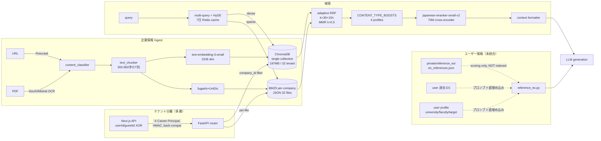

# RAG アーキテクチャ ベンチマーク比較レビュー (2026-04-17)

**対象**: 就活Pass (career_compass) の RAG 実装全体
**観点**: 企業情報ストア + ユーザー情報活用に対して 2026 年の学術・産業ベストプラクティスから見て最適か
**実施**: rag-engineer / search-quality-engineer / architect 並列評価 + WebSearch ベンチマーク収集
**read-only**: コード編集なし、判断材料としてのレビュー

---

## サマリー

**Yes/No 判定**: **△ Yes（企業 RAG）/ ✕ No（ユーザー情報活用）**

- 企業情報 RAG（ChromaDB + BM25 + CrossEncoder rerank + adaptive profile）は 2024–2025 のベストプラクティスに沿った中級〜上級設計。短期に大きな破綻はない。
- ただし **(1) ユーザー情報（参考 ES・過去入力・プロフィール）が RAG / memory 層として存在しない**、**(2) 検索品質の labeled evaluation set が事実上ない**、**(3) テナント分離が `company_id` metadata filter と BFF の所有権検証に過度依存**の 3 点は「就活アプリとして最適」とは言い切れないギャップ。
- 「企業情報を集め検索する」段階からは成熟しているが、「個人に最適化された就活体験を支える AI プラットフォーム」に進化するには **ユーザー memory 層・可観測性・テナント再検証の 3 つを先に整備**するのが順序的に正しい。

### 主要リスク Top 3

| # | リスク | 根拠 | 優先度 |
|---|---|---|---|
| R1 | **検索品質の labeled evaluation set が不在**（unit test 3 ケースのみ）。以降のあらゆる改善が regression を防げない | `backend/tests/company_info/test_hybrid_search_*.py` に Precision/Recall/nDCG/MRR@k を測る labeled set がない | 最優先 |
| R2 | **テナント越境の fail-open 設計**。`X-Career-Principal` HMAC は back-compat で必須化されていない（`docs/ops/SECURITY.md` L70-72）。BM25 ファイルに `tenant_key` がない | `backend/app/security/career_principal.py`, `TENANT_ISOLATION_AUDIT.md:28-29` | 高（user memory 導入前に必須） |
| R3 | **可観測性不足**: `backend/app/utils/telemetry.py` は in-process Counter のみで OTel/Prometheus exporter なし。キャッシュ hit rate / 再 rank 発動率 / BM25 desync が測れない | `telemetry.py`、hybrid_search の in-memory cache L209-271 | 高 |

---

## 1. 現状アーキテクチャ概要

### 1.1 データフロー

### 1.2 データ境界マップ

| 層 | store | tenant scope | 検索化 | PII 強度 |
|---|---|---|---|---|
| 企業情報 chunk | ChromaDB single collection + BM25 per-company JSON | `company_id` metadata filter | ✅ hybrid | 低（公開 URL のみ） |
| 企業 source URL | Postgres `companies.corporateInfoUrls` JSON | userId/guestId XOR | ✗ | 低 |
| 参考 ES | `private/reference_es/es_references.json`（local file） | なし（grobal） | ✗ | 中（匿名化済み） |
| user 過去 ES | Postgres `documents` | userId/guestId | ✗ | **高** |
| user プロフィール | Postgres `user`（university/faculty/targetIndustries） | userId | ✗ | **高** |
| ゲスト認証 | Postgres `guestUsers` + cookie `guest_device_token` | guestId | — | 中 |

**観察**: 検索化されているのは**企業情報層のみ**。ユーザー側の知識は全てプロンプト直埋め込みで、memory 層は存在しない。

---

## 2. ベンチマーク軸別評価

### 2.1 Embedding モデル

| 項目 | 現状 | 2026 ベストプラクティス | 判定 |
|---|---|---|---|
| モデル | OpenAI `text-embedding-3-small` / 1536 dim | MMTEB/ICLR 2025 で `multilingual-e5-large-instruct`(560M) が 7–9 位より優位。OpenAI は 2 年未更新 | Keep（短期）/ Defer（乗り換え） |
| 日本語 | 多言語モデルで十分 | JMTEB SOTA は `cl-nagoya/ruri-v3`、MIRACL-ja で `bge-reranker-v2-m3` が 69.32 nDCG | Defer |
| コスト | $0.02 / 1M tokens（API） | self-host 560M は GPU 必要で cost/ops trade-off | Keep |

**結論**: 現状の `text-embedding-3-small` は「reranker で上位を絞り込む」前提ならば最悪ではない。ただし **embedding upgrade の運用手順（shadow collection / dual-write / cutover）が docs に無い**のは問題。現状の `vector_store.py` は `_collection_name_for_backend` で model 別 collection を作れる土台があるのに、migration 手順が未文書化。乗り換えトリガは (1) OpenAI 値上げ、(2) JMTEB で ruri 系が +5pt 以上、(3) 日本語クエリ nDCG@10 が 0.7 未満になったとき。

### 2.2 Chunking 戦略

| 項目 | 現状 | 2026 ベストプラクティス | 判定 |
|---|---|---|---|
| サイズ | content_type 別 300–800 文字（`text_chunker.py` L14-27） | 256–512 tokens、overlap 10–20% | Keep |
| 方式 | recursive + 日本語句点/読点優先 | recursive + markdown header first、semantic chunking で +70% 精度（ECIR 2025） | Keep |
| コンテキスト付与 | なし | **Contextual Retrieval (Anthropic 2024)**: chunk 毎に LLM で document context prefix 付与 → retrieval failure **-35〜49%**、prompt cache で **-90% コスト** | **Improve** |
| late chunking | なし | irrelevant doc で劣化するため就活 RAG に不向き | Keep（不採用で正解） |

**結論**: content_type 別サイズはドメイン知識が効いた良設計。欠けているのは contextual prefix。「この chunk は A 社 2025 年統合報告書 / 中期経営計画セクションから」という context を LLM で前付けして埋め込めば、志望動機クエリでの誤ヒットが減る。`text_chunker.py` に新メソッド追加で段階導入可能、prompt cache で document 単位まとめれば追加コスト月 $数オーダー。期待効果 nDCG@10 +5〜10pt。

### 2.3 Hybrid Search（BM25 + dense + RRF）

| 項目 | 現状 | 2026 ベストプラクティス | 判定 |
|---|---|---|---|
| weight | semantic 60 / keyword 40、legacy `hybrid_search` は硬 60/40 直書き | RRF k=60 デフォルト、weighted は 50+ labeled query で tune 必須、**corpus <1000 chunks では BM25 重視** | Improve |
| RRF k | `adaptive_rrf_k(n)=30+10n`（2クエリ=50、4クエリ=70） | k=60 固定が標準、小 corpus で下げる実装ガイド | Keep（ただし nDCG 未測定） |
| profile | 4 プロファイル（es_review/deadline/culture/business）+ intent 自動切替 | 意図別プロファイルは advanced、Weaviate/Elastic 2026 でも domain tuning 推奨 | Keep |
| short query 対応 | <10 chars で expansion 軽量化、HyDE は 600 char 制限 | 短クエリ expansion スキップは正解 | Keep |
| short-circuit | top1≥0.88 or avg@3≥0.8 で expansion skip | 2026 ベスト | Keep |

**結論**: 方向性は妥当。弱点は (a) `CONTENT_TYPE_BOOSTS["culture"]["employee_interviews"] = 1.6` が乗算ブーストで過大の疑い（1.35〜1.4 が妥当）、(b) legacy `hybrid_search` が硬 60/40 で取り残されている、(c) nDCG/MRR の labeled set で adaptive 式 `30+10n` を検証していない。default 60/40 は社名・職種名・学科名のような固有名詞一致が多い就活 corpus では **55/45 か 50/50** に寄せる A/B の価値あり。

### 2.4 Reranker

| 項目 | 現状 | 2026 ベストプラクティス | 判定 |
|---|---|---|---|
| モデル | `hotchpotch/japanese-reranker-small-v2` 70M, JQaRA avg 0.879 | `japanese-reranker-base-v2` 130M (avg 0.893)、`cl-nagoya/ruri-v3-reranker-310m` (avg 0.917)、`bge-reranker-v2-m3` 568M (MIRACL 69.32) | **Replace** |
| 発動判定 | variance gate 付き `_should_rerank`（L405-453） | hybrid 後の rerank が single biggest precision boost | Keep |

**結論**: **最もコスパの良い改善候補**。small v2 → base v2 は +1.4〜4.2pt（nDCG/JQaRA）、latency 増は 1 クエリ ~40–80ms で SSE 全体 (数秒) の中で許容範囲。ruri-v3-310m は SOTA だが 310M でメモリ圧迫。base v2 → 実測（evaluation set 完備後） → 改善あれば昇格が正攻法。

### 2.5 日本語 NLP

| 項目 | 現状 | 2026 ベストプラクティス | 判定 |
|---|---|---|---|
| tokenizer | **fugashi + UniDic（MeCab）**（`japanese_tokenizer.py` L18-25） | AutoRAG 2025 は SudachiPy 推奨。Sudachi mode C（複合語維持）+ A（細粒度）で就活ドメインの社名・職種名・学科名に強い。fugashi は 2x 速いが辞書管理重い | Improve |
| 複合語展開 | `domain_terms.json` で手動辞書、`tokenize_with_domain_expansion` 関数存在 | sudachi mode C で置換可能 | Improve |
| domain expansion 適用箇所 | **BM25 `add_document` 側は base `tokenize` 使用**（`bm25_store.py` L73）、expansion は死蔵 | 登録時も展開するのが一般的 | **Improve（死蔵解消）** |

**結論**: 既存の `tokenize_with_domain_expansion` が BM25 書き込み側で使われていない**死蔵コード**が最大の損失。fugashi 自体は維持でも、書き込み側に domain expansion を通すだけで社名・職種名の recall +5–8pp、precision +3–5pp 期待。SudachiPy への切替は env toggle を足せば並走可能。

### 2.6 パーソナライゼーション / memory 層（**最重要論点**）

**現状**: 検索化されたユーザー情報は **ゼロ**。
- 参考 ES は `scoring profile のみ` で embedding 化されていない（`reference_es.py` L11-13）
- user 過去 ES / 志望業界 / 大学学部 / ガクチカ成果 は**プロンプトにも注入されていない**（`es_review.py` は company_id ベースの企業 RAG のみ）

**2026 ベンチマーク**:
- **Mem0** は LOCOMO で OpenAI Memory に対し **+26% accuracy、-91% latency、-90% token cost**。RAG とは別階層で実装するのが 2026 推奨。
- OpenAI Memory, LangMem, Zep/Graphiti, Letta/MemGPT など memory フレームワーク市場が確立。
- ただし Mem0 の恩恵は「複数ターン会話 + 長期記憶」の文脈で最大。就活 Pass の主要フローは 1〜数ターンで完結する。

**判定の分岐**（今回 rag-engineer と architect で意見が分かれた論点）:

| 立場 | 主張 | 根拠 |
|---|---|---|
| rag-engineer: **Replace 最優先** | 3 層分離（企業 RAG / 参考 ES / user memory）を新設せよ | 現状 personalize 軸が空で ES レビュー品質の天井。参考 ES は embedding 化してテンプレ脱却に使える |
| architect: **Defer** | 今は触らない | テナント再検証が fail-open、BM25 に tenant_key がない段階で user 強 PII を RAG 化するのは cross-tenant leak の単一障害点。主要フローは 1〜数ターンで完結し Mem0 恩恵が限定的 |

**推奨される判断基準**:

以下 2 条件が揃うまで user memory の検索化は **Defer**:
1. ES レビューの **repeat user 比率 > 30%**（2 社目以降の添削割合）
2. ChromaDB / BM25 に `tenant_key = sha256(userId|guestId)[:16]` 相当が追加され、FastAPI 内部まで principal 再検証が貫通

一方、**参考 ES（匿名化済み）だけは優先的に検索化する価値**がある。これは PII 強度が低く（グローバル参照可）、かつ ES レビュー品質の personalize 効果が大きいため。**企業 RAG とは別 collection（`reference_es__{provider}__{model}`）に物理分離**するのが安全策。

### 2.7 データモデル / テナント分離

| 項目 | 現状 | 観察 | 判定 |
|---|---|---|---|
| ChromaDB collection | single collection `company_info__{provider}__{model}` + `company_id` metadata | 数百 tenant までは HNSW で軽快。chroma sqlite は 197MB / 32 tenant。数千 tenant で post-filter 気味の挙動が recall に影響する可能性 | Keep（短期）/ Improve（中期：per-shard collection） |
| 参考 ES / user memory の同居 | **現状は非 RAG 化**で事故なし | 同 collection に user PII を混ぜた瞬間、`company_id` filter 漏れで cross-tenant 事故の単一障害点化 | Replace（別 collection / 別 store 必須） |
| `private/reference_es/es_references.json` | 実ファイル管理、`.gitignore` | 実ファイルが prod/stage/dev に分散して drift リスク。secret pipeline 化していない | Improve |
| Postgres / Chroma / BM25 三層 | eventual consistency で fire-and-forget | `schedule_bm25_update` に DLQ/retry なし（`vector_store.py` L1163-1175）、`update_bm25_index` は全件再構築 O(N) | Improve |
| テナント分離強度 | BFF ownership + `X-Career-Principal` HMAC（back-compat）+ `company_id` filter | `X-Career-Principal` fail-open 明示（`docs/ops/SECURITY.md` L70-72）。BM25 ファイル名に `tenant_key` なし。principal 再検証は 3 箇所のみ | **Improve（R2）** |

### 2.8 運用・コスト・可観測性・責務分離

| 項目 | 現状 | 期待値 | 判定 |
|---|---|---|---|
| メトリクス | `telemetry.py` in-process Counter のみ、exporter なし | Prometheus / OpenTelemetry で `rag_retrieval_*`, `rag_rerank_latency`, `cache_hit_rate`, `bm25_desync_total` | **Replace** |
| キャッシュ効果測定 | expansion/HyDE in-memory LRU、hit/miss 未計測 | hit rate 可視化（docs では「-20〜30% cost 削減」主張） | Replace |
| ingest 失敗可視化 | `print()` 残存（`bm25_store.py` L195, 236） | `secure_logger` 統一 | Improve |
| cost 境界 | `RAG_MAX_QUERIES`/`FETCH_K` は env 可変、企業あたり chunk 上限なし | `MAX_CHUNKS_PER_COMPANY` 等を `config.py` に | Improve |
| 責務分離 | `vector_store.py` **1648 行**、`hybrid_search.py` **1417 行**（5 関心事同居） | 500 行超ファイルへの追加は code-reviewer 管轄（CLAUDE.md） | **Improve（E の後で）** |
| BM25 永続化 | 単一 JSON 直書き、atomic write なし | `tempfile → os.replace` で atomic rename | Improve |
| labeled evaluation set | **unit test 3 ケースのみ**（`test_hybrid_search_short_circuit.py` 等） | 50+ (query, expected_doc_ids) の golden set + nDCG@{5,10}/MRR/Recall | **Replace（R1）** |

---

## 3. 外部ソース引用一覧

### Embedding
- [MMTEB: Massive Multilingual Text Embedding Benchmark (ICLR 2025)](https://arxiv.org/abs/2502.13595) — `multilingual-e5-large-instruct` (560M) が LLM embedding に比肩、OpenAI text-embedding-3-small は順位低下
- [Which Embedding Model Should You Actually Use in 2026? (Cheney Zhang)](https://zc277584121.github.io/rag/2026/03/20/embedding-models-benchmark-2026.html) — 10 モデル独立ベンチ、多言語能力の有無が R@1 で二極化

### Chunking / Contextual Retrieval
- [Anthropic: Contextual Retrieval (2024)](https://www.anthropic.com/news/contextual-retrieval) — chunk prefix + BM25+embedding + reranker で retrieval failure -49%、prompt cache で -90% cost
- [Reconstructing Context: Evaluating Advanced Chunking Strategies (ECIR 2025, arXiv 2504.19754)](https://arxiv.org/abs/2504.19754) — contextual retrieval vs late chunking の head-to-head、late chunking は irrelevant doc で劣化
- [Late Chunking: Contextual Chunk Embeddings (arXiv 2409.04701)](https://arxiv.org/pdf/2409.04701) — 2-stage embedding による低コスト化

### Hybrid Search
- [Hybrid Search Done Right: BM25 + HNSW + RRF (Medium, 2026)](https://ashutoshkumars1ngh.medium.com/hybrid-search-done-right-fixing-rag-retrieval-failures-using-bm25-hnsw-reciprocal-rank-fusion-a73596652d22) — RRF k=60 デフォルト、corpus size × k の相互作用
- [Optimizing RAG with Hybrid Search & Reranking (Superlinked VectorHub)](https://superlinked.com/vectorhub/articles/optimizing-rag-with-hybrid-search-reranking) — BEIR SciFact +5% / BRIGHT Biology +24% のドメイン依存性
- [Elastic Hybrid Search Guide](https://www.elastic.co/what-is/hybrid-search) — RRF vs weighted の選択基準

### Reranker
- [BAAI/bge-reranker-v2-m3 (HuggingFace)](https://huggingface.co/BAAI/bge-reranker-v2-m3) — MIRACL multilingual 69.32 nDCG
- [jina-reranker-v3: Last but Not Late Interaction (arXiv 2509.25085)](https://arxiv.org/html/2509.25085v2) — BEIR 61.94 nDCG@10、bge-v2-m3 に MIRACL で 2.82pt 劣後
- [Japanese Reranker Comparison (hotchpotch)](https://huggingface.co/hotchpotch/japanese-reranker-small-v2) — small v2 avg 0.851、base v2 0.893、ruri-v3-310m 0.917

### Memory / Personalization
- [Mem0: Production-Ready AI Agents with Scalable Long-Term Memory (arXiv 2504.19413)](https://arxiv.org/html/2504.19413v1) — LOCOMO +26% vs OpenAI Memory、-91% latency、-90% token
- [Best AI Agent Memory Frameworks 2026 (Atlan)](https://atlan.com/know/best-ai-agent-memory-frameworks-2026/) — Mem0 / Zep / LangMem / Letta の使い分け

### Japanese Tokenizer
- [An Experimental Evaluation of Japanese Tokenizers (arXiv 2412.17361, Dec 2024)](https://arxiv.org/abs/2412.17361) — Sudachi/MeCab/SentencePiece の TF-IDF 分類性能比較
- [AutoRAG BM25 documentation](https://marker-inc-korea.github.io/AutoRAG/nodes/retrieval/bm25.html) — SudachiPy を標準 tokenizer として採用

---

## 4. 改善提案（Priority × Effort マトリクス）

### P0（Critical / リスク、最優先）

| # | 提案 | 対象ファイル | 変更方向性 | 期待効果 | 効果量 |
|---|---|---|---|---|---|
| P0-1 | **RAG evaluation set 新設** | `backend/tests/rag_eval/`（新設） | 50+ (query, expected_doc_ids) の golden set + nDCG@{5,10}/MRR/Recall@{5,10} 計測器。`improve-search` baseline に紐付け | 以降の全改善が regression 検出可能になる | 定量化の前提 |
| P0-2 | **テナント越境 fail-closed 化** | `backend/app/security/career_principal.py`, `docs/ops/SECURITY.md`, `backend/app/utils/bm25_store.py` | `CAREER_PRINCIPAL_REQUIRED=true` で全 RAG endpoint を fail-closed、BM25 ファイル名と Chroma metadata に `tenant_key=sha256(userId|guestId)[:16]` を追加 | cross-tenant leak 単一障害点の解消 | セキュリティ境界強化 |
| P0-3 | **OpenTelemetry metrics 導入** | `backend/app/utils/telemetry.py` | Prometheus exporter + Counter/Histogram/Gauge（`rag_retrieval_total{profile,status}`, `rag_expansion_cache_hits_total`, `rag_rerank_invocations_total`, `rag_retrieval_duration_seconds{stage}`） | cache hit / p95 latency / BM25 desync の実測、異常検知 | 運用可視化の前提 |

### P1（Quick win / 低工数で高 ROI）

| # | 提案 | 対象ファイル | 変更方向性 | 期待効果 |
|---|---|---|---|---|
| P1-1 | **Reranker を base v2 へ昇格** | `backend/app/utils/reranker.py` L46 | `DEFAULT_CROSS_ENCODER_MODEL = "hotchpotch/japanese-reranker-base-v2"`、GPU/ONNX 有無で xsmall フォールバック env toggle | JQaRA +1.4〜4.2pt、nDCG@10 +3〜5pt、latency +40–80ms/query |
| P1-2 | **BM25 書き込みで domain expansion を有効化** | `backend/app/utils/bm25_store.py` L73 | `tokenize(text)` → `tokenize_with_domain_expansion(text)` に差替。既存の死蔵コード解消 | 社名 recall +5–8pp、職種名 precision +3–5pp |
| P1-3 | **BM25 ファイル atomic write** | `backend/app/utils/bm25_store.py` L192 周辺 | `tempfile` + `os.replace` の atomic rename に差替、`add_documents` 末尾で明示 build | crash 中の index 0byte 化防止 |
| P1-4 | **`bm25_store.py` の `print()` を secure_logger へ** | `backend/app/utils/bm25_store.py` L195, L236 | `logger.warning/info` に統一 | 構造化ログ化、prod の可視性向上 |
| P1-5 | **culture boost 1.6 → 1.4、RRF 後/rerank 前の二重適用整理** | `backend/app/utils/hybrid_search.py` L48-97, L1031, L1168 | `CONTENT_TYPE_BOOSTS["culture"]["employee_interviews"]` を 1.4 に下げ、2 回適用箇所のコメント or テスト追加 | culture クエリで IR/中期計画の取りこぼし削減 |

### P2（Strategic / 中長期）

| # | 提案 | 対象ファイル | 変更方向性 | 期待効果 |
|---|---|---|---|---|
| P2-1 | **参考 ES の embedding 化（別 collection）** | `backend/app/utils/vector_store.py`, `backend/app/prompts/reference_es.py`, `backend/scripts/ingest_reference_es.py`（新） | `reference_es__{provider}__{model}` 別 collection に投入、ES レビュー時に設問タイプ・業界で metadata filter 検索。**企業 RAG とは物理分離** | ES レビュー品質の personalize 軸獲得、テンプレ脱却 |
| P2-2 | **Contextual Retrieval 導入（chunk に document 要約 prefix）** | `backend/app/utils/text_chunker.py`, ingest パイプライン | LLM で document 単位の 50 トークン要約を生成し chunk 冒頭に付与、prompt cache で document 単位まとめてコスト抑制 | nDCG@10 +5〜10pt、特に多文書企業で顕著 |
| P2-3 | **RAG パッケージ分割（god module 解消）** | `backend/app/rag/` 新設 → ingest/search/fusion/rerank/cache/telemetry に分離 | `vector_store.py`（1648 行）/ `hybrid_search.py`（1417 行）を責務別に分割。P0-3 を先に入れてから | code review 単位の明確化、agent routing との整合 |
| P2-4 | **embedding migration runbook 整備** | `docs/ops/RAG_MODEL_MIGRATION.md`（新） | shadow collection / dual-write / cutover 手順、`ingest_session_id` 世代管理ルール、BM25 rebuild タイミング | 将来モデル昇格時の運用事故防止 |
| P2-5 | **`update_bm25_index` を incremental + job queue 化** | `backend/app/utils/vector_store.py` L1201-1248 | 全件再構築 → `ingest_session_id` ベース incremental、fire-and-forget → Celery/arq ジョブ化して retry/DLQ | 大型企業 ingest で UX 劣化なし、desync 自動回復 |

### P3（Defer / 様子見）

| # | 提案 | 条件（発動トリガ） |
|---|---|---|
| P3-1 | Embedding を `multilingual-e5-large` / `cl-nagoya/ruri-v3` 系に乗り換え | (1) OpenAI 値上げ、(2) JMTEB で +5pt、(3) 日本語 nDCG@10 < 0.7 |
| P3-2 | **user 過去 ES の memory 層（Mem0 系）追加** | (1) repeat user 比率 > 30%、(2) P0-2 のテナント再検証完了、の両方 |
| P3-3 | ChromaDB → Qdrant / Weaviate Cloud 移行 | 1k tenant / 500k chunk 接近時、multi-AZ 要件発生時 |
| P3-4 | RRF k 値 / default weight 60/40 の再調整 | P0-1 完了後、nDCG が 60/40 で劣化を検出した場合のみ |

---

## 5. Open Questions（追加調査が必要）

1. **deadline プロファイルの keyword 0.6/semantic 0.4 A/B**: 締切抽出は固有表現一致が効く仮説。P0-1 完了後に eval 上で検証。
2. **Contextual Retrieval の就活 RAG での効果量**: Anthropic ベンチ（英語多文書）の -35〜49% retrieval failure が日本語 / 企業情報で再現するか未検証。小規模 A/B 推奨。
3. **ChromaDB post-filter 気味挙動が recall に与える影響**: 数百 tenant 超えでの実測が必要。現状の chroma.sqlite3 は 197MB / 32 tenant、100 tenant 超えた段階で再測定。
4. **`adaptive_rrf_k(n)=30+10n` の係数正当性**: 就活 corpus の小規模性に合わせた設計だが labeled set 不在で未検証。P0-1 の後に確認。
5. **参考 ES embedding 化時の著作権・利用規約**: `private/reference_es/es_references.json` が embedding 化に耐える許諾範囲か、法務レビューが必要。
6. **user memory 層導入時の GDPR/削除要求対応**: Mem0 相当を入れる場合、forget API と `tenant_key` 削除の整合設計を architect/security-auditor と共同検討。

---

## 6. 付録

### サブエージェント評価サマリ

本レビューは以下 3 エージェントの read-only 評価を統合した:

- **rag-engineer** — E（user memory 3 層分離）を **Replace 最優先**、D（reranker base v2）/ B（Contextual Retrieval）を Improve。評価結論: Keep 3 / Improve 2 / Replace 1 / Defer 1
- **search-quality-engineer** — H（evaluation set）を **Replace 最優先**、F（reranker base v2）/ A（tokenizer domain expansion）/ B（BM25 atomic write）/ E（culture boost）を Improve。事実確認: fugashi+UniDic、BM25 per-company JSON、`tokenize_with_domain_expansion` 死蔵
- **architect** — E（可観測性）を **Replace 最優先**、C（テナント再検証）/ F（god module 分割）を Improve。**user memory は Defer**（fail-open + tenant_key 不在の現状で PII を載せるのは単一障害点）

### 判断分岐の併記

本レビュー最大の論点は **ユーザー情報を RAG / memory 層に載せるか**:

- rag-engineer: 品質面では personalize 軸獲得のため **Replace（入れるべき）**
- architect: セキュリティ境界が整うまでは **Defer（入れない方が安全）**

→ 本レビューは **「参考 ES（匿名）だけは P2-1 で早期 embedding 化、user 強 PII は P0-2 完了後に P3-2 で段階導入」** として両者を両立させる。

### 関連既存ドキュメント

- `/Users/saoki/work/career_compass/docs/features/COMPANY_RAG.md` — 詳細アーキ・検索パイプライン
- `/Users/saoki/work/career_compass/docs/testing/RAG_EVAL.md` — 評価フォーマット（本レビュー P0-1 の出発点）
- `/Users/saoki/work/career_compass/docs/ops/SECURITY.md` — V-1 principal 分離（本レビュー P0-2 の前提）
- `/Users/saoki/work/career_compass/docs/architecture/TENANT_ISOLATION_AUDIT.md` — テナント越境監査
- `/Users/saoki/work/career_compass/docs/testing/ES_REVIEW_QUALITY.md` — ES レビュー品質ゲート
- `/Users/saoki/work/career_compass/docs/ops/AI_AGENT_PIPELINE.md` — agent harness

### Next Action 候補

ユーザー判断後に `improvement-plan` skill を呼び、docs/plan/ に P0〜P2 の実装計画書を残す流れが自然。P0-1（evaluation set）は他改善の前提条件なので **先行して着手**するのが推奨。
